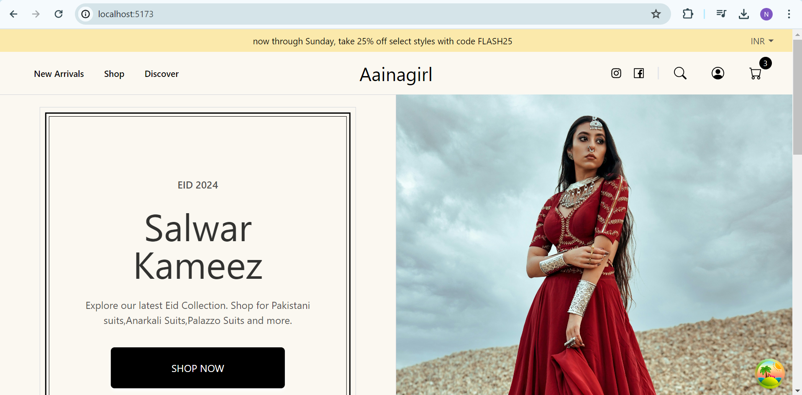
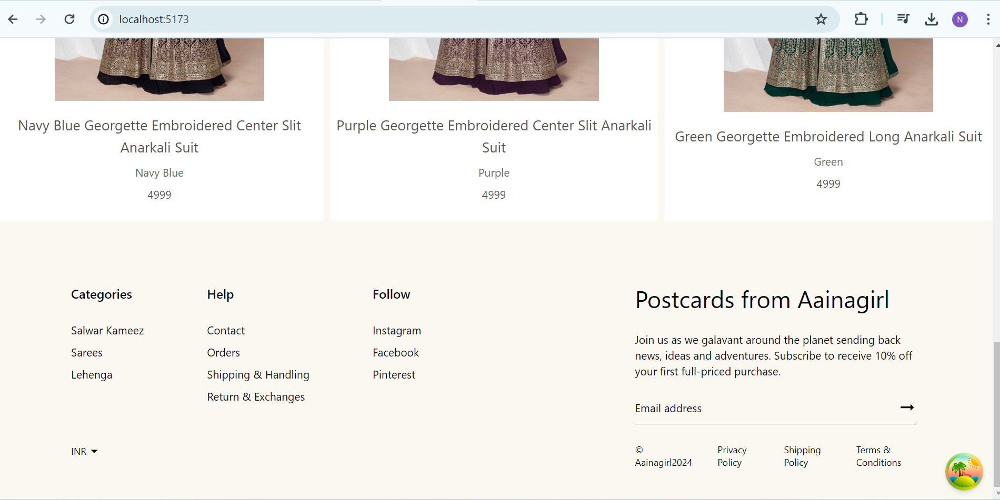
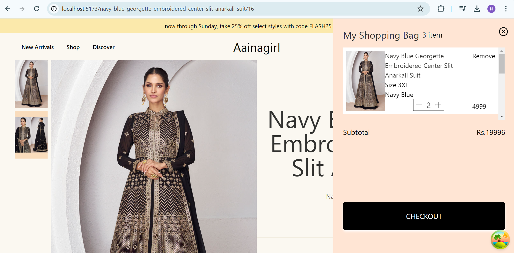

# Ecommerce Portal

Built an eCommerce portal for selling clothes. Implement custom size options, payment gateway integration, currency converter, authentication & authorization, social logins. 

## Table of contents

- [Overview](#overview)
  - [Screenshot](#screenshot)
- [My process](#my-process)
  - [Built with](#built-with)
- [Installation](#installation)  
  - [Frontend] (#frontend)
  - [Backend] (#Backend)
- [Author](#author)

## Overview

Users should be able to:

- Create/Update an account.
- Add/Delete/Update products to shopping cart.
- Custom made to order.
- Checkout and pay using payment gateway.
- View Order Details.
- Track order.
- Contact using contact form.
- View the optimal layout for the interface depending on their device's screen size
- See hover and focus states for all interactive elements on the page

### Screenshot

Homepage

Footer

Shopping Cart

## My process

### Built with

Frontend :
1) React Js
2) Redux
3) React Router
4) Context Api
5) React Query
6) Tailwind CSS
7) Mobile First Approach
8) Responsive Web Design

Backend:
1) SpringBoot
2) Spring Jpa
3) Spring Security
4) MySql
5) Docker
6) Postman

## Installation

### Backend 

Run the follwing command: 

1) create a mysql container or use mysql server and client (update application.yml file based of your mysql configuration)
2) run the scripts to create table and insert data to tables (check scripts folder inside backend)
3) run the main application file.

### Frontend

Run the following command : 
1) npm install
2) num run dev

## Author
- Frontend Mentor - [@nazimulhossain](https://www.frontendmentor.io/profile/nazimulhossain)
- Linkedin - (https://www.linkedin.com/in/nazimul-hossain-84a62946/)